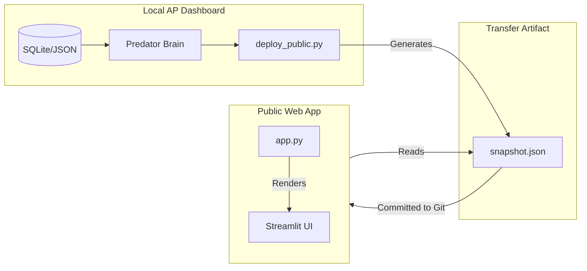

# AP Public View Deployment Protocol (Deep Clone)

> **Version**: 1.1
> **Component**: Public Web Viewer
> **Core Principle**: "Snapshot Based Rendering" (Zero Logic Clone)
> **Remote Repo**: https://github.com/tfbomber/alpha-picks-tracker

## 1. Architecture Overview

The **AP Public View** (`AP_Public_View` repo) is a **read-only**, **static snapshot renderer** designed to mirror the Local AP Dashboard's "Performance Overview" tab pixel-for-pixel.

### Deep Clone Philosophy
-   **Source (Local)**: `AP Dashboard` project contains all business logic, database connections, and AI engines (Predator).
-   **Bridge (Snapshot)**: `deploy_public.py` executes internal logic to generate a rich `snapshot.json`.
-   **Destination (Public)**: `app.py` acts as specific "dumb terminal" that only renders the JSON. It has **NO** access to databases, APIs, or calculation engines.



---

## 2. Source: Deployment Script (`deploy_public.py`)

**Path**: `d:/Stock%20Analysis/AP%20Dashboard/deploy_public.py`

### Responsibilities
1.  **Load Data**: Uses `dashboard_data_loader.py` to fetch the Unified Portfolio (AP + Real).
2.  **Generate View Models**: Calls internal dashboard functions (e.g., `get_performance_view_model`) to ensure 100% calculation consistency.
3.  **Enrich Data**:
    -   **Focus List**: Embeds full AI analysis (`logic_pillars`, `action_plan`) and detailed triggers (`trigger_details`) into the JSON.
    -   **Table**: Maps columns (e.g., `day_change_pct` -> `Day%`) and formats values.
    -   **Picked Date**: Joins `picked_date` from the Alpha Picks portfolio into both Focus and Table view models.
4.  **Serialize**: Converts all data to a JSON-serializable format (handling NaNs, Dates).
5.  **Write & Push**: Saves to `AP_Public_View/data/snapshot.json` and auto-commits to GitHub.

### Execution
```powershell
python "d:/Stock Analysis/AP Dashboard/deploy_public.py"
```

---

## 3. Bridge: Snapshot Schema (`snapshot.json`)

**Path**: `d:/Stock%20Analysis/AP_Public_View/data/snapshot.json`

The snapshot contains three main sections:

### 3.1 Meta
Metadata for UI status and freshness.
```json
"meta": {
  "updated_at": "2026-02-01 09:25:43",
  "focus_message": "", // Custom empty state message
  "sync_success": true
}
```

### 3.2 Focus View Model (`focus_view_model`)
High-fidelity data for the Top 8 Focus List.

| Field | Description |
| :--- | :--- |
| `ticker`, `verdict`, `urgency` | Basic card display info. |
| `signal`, `news`| Trigger signal and news sentiment string. |
| `picked_date` | Alpha Picks picked date (string, e.g., `1/15/2026`). |
| `trigger_details` | **Object**. Contains `trigger_type`, `current_price`, `key_level`, and `details` text for the "Facts" panel. |
| `logic_pillars` | **Object**. Contains `technical`, `volume_analysis`, `news_catalyst` for the "AI Judgement" panel. |
| `action_plan` | AI Action Plan text. |
| `divergence` | Divergence analysis text. |

### 3.3 Table View Model (`table_view_model`)
Pre-formatted table data.

| Field | Description |
| :--- | :--- |
| `ticker`, `price` | Basic market data. |
| `Day%` | Daily change percentage (Float, e.g., `-1.5` for -1.5%). |
| `picked_date` | Alpha Picks picked date (string). |
| `quant`, `value_grade`... | Pre-formatted strings or raw grades. |

---

## 4. Destination: Public App (`app.py`)

**Path**: `d:/Stock%20Analysis/AP_Public_View/app.py`

### Responsibilities
1.  **Render Only**: Does NOT calculate anything. Reads `snapshot.json` strictly.
2.  **Interactive UI**:
    -   **Selection State**: Uses `st.session_state.focus_selected` to track user clicks.
    -   **Detail Panel**: Conditionally renders "Facts" and "AI Judgement" based on selected ticker.
3.  **Styling Match**:
    -   Uses `st.text_area` for Facts (gray box style).
    -   Uses `st.caption` for AI analysis to match Local Dashboard typography.
    -   Hides sections if data is missing (e.g., "No execution audit data saved").
4.  **Masked Display**:
    -   Focus List card title masks ticker with stars and appends picked date (e.g., `L*(Picked: 12/16/2024)`).
    -   Alpha Picks table masks ticker and displays `Picked` as the second column.
    -   Masking is UI-only; snapshot data remains unmasked.

---

## 5. Maintenance Guidelines

### Adding a New Column
1.  **Local**: Ensure column exists in `dashboard_data_loader.py`.
2.  **Deploy**: Update `deploy_public.py` to include the column in the `merge` list (handle missing columns safely).
3.  **Public**: Update `app.py`'s `st.dataframe` `column_config` to render it.

### Troubleshooting "Empty Focus List"
-   Check `deploy_public.log` for **Missing Column Crashes** (common cause for silent failure).
-   Verify `audit_store` has data for today (Focus List depends on AI Audits).
-   Run `debug_focus.py` to verify database connectivity.
